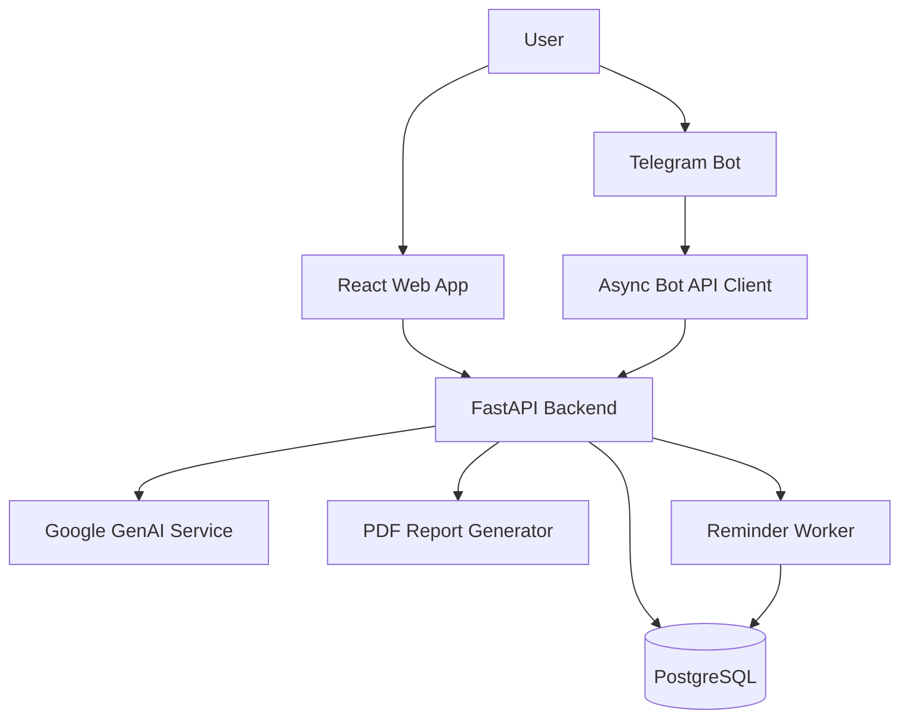
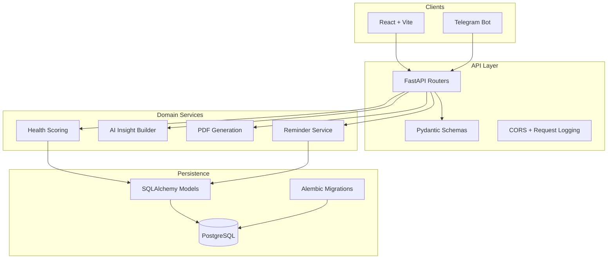
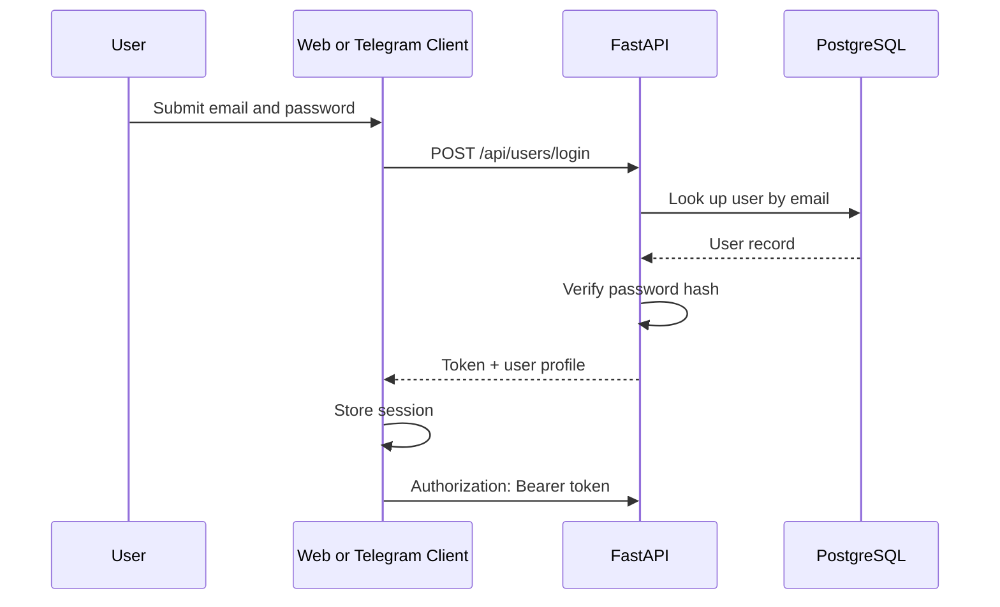
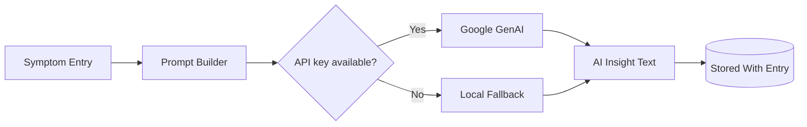
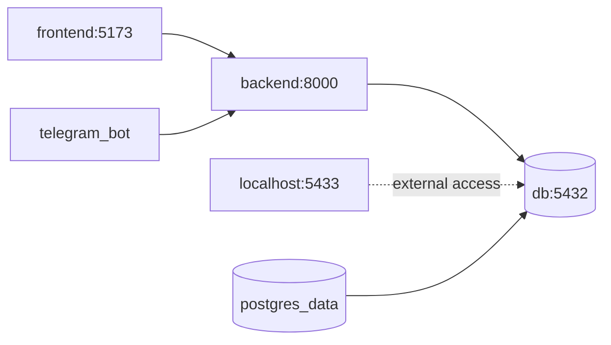

<div align="center">
  <br />
  <h1>Diary of Symptoms</h1>
  <p>
    A full-stack health diary for tracking symptoms, medications, reminders, and AI-assisted symptom insights across web and Telegram.
  </p>
</div>

<p align="center">
  
  
  
  
  
  
  
  
  
</p>

<p align="center">
  <a href="#-features">Features</a>
  ·
  <a href="#-architecture">Architecture</a>
  ·
  <a href="#-getting-started">Getting Started</a>
  ·
  <a href="#-api-documentation">API</a>
  ·
  <a href="#-contributing">Contributing</a>
</p>

---

Diary of Symptoms helps people capture health signals while they are still fresh: symptoms, severity, sleep, stress, medications, reminders, and notes. The platform combines a React dashboard, FastAPI backend, PostgreSQL persistence, Telegram bot workflows, PDF exports, and AI-generated insight summaries.

> [!IMPORTANT]
> This project is a health-tracking and analysis tool. It is not a medical device and does not replace professional medical advice, diagnosis, or treatment.

## Preview

<p align="center">
  
</p>

<p align="center">
  <b>Web Dashboard</b>
</p>

<details>
<summary>More screenshot placeholders</summary>

### Login

<p align="center">
  
</p>

### Symptom Tracking

<p align="center">
  
</p>

### AI Analysis

<p align="center">
  
</p>

### Telegram Bot

<p align="center">
  
</p>

</details>

---

## Table of Contents

- [Features](#-features)
- [Why This Project?](#-why-this-project)
- [Architecture](#-architecture)
- [Tech Stack](#-tech-stack)
- [Project Structure](#-project-structure)
- [Getting Started](#-getting-started)
- [Environment Variables](#-environment-variables)
- [API Documentation](#-api-documentation)
- [Authentication](#-authentication)
- [AI Module](#-ai-module)
- [Telegram Bot](#-telegram-bot)
- [Docker](#-docker)
- [Testing](#-testing)
- [Security](#-security)
- [Performance](#-performance)
- [Roadmap](#-roadmap)
- [Contributing](#-contributing)
- [License](#-license)
- [Author](#-author)
- [Acknowledgements](#-acknowledgements)
- [Support](#-support)
- [Star History](#-star-history)

---

## ✨ Features

<table>
  <tr>
    <td width="33%">
      <h3>🩺 Health Tracking</h3>
      <p>Record symptoms with severity, duration, sleep quality, stress level, body state, food notes, and medication context.</p>
    </td>
    <td width="33%">
      <h3>🤖 AI Features</h3>
      <p>Generate short symptom insights that highlight possible triggers and practical next-step recommendations.</p>
    </td>
    <td width="33%">
      <h3>🔐 Authentication</h3>
      <p>Register and log in users through the API, then keep client sessions available across the web app and bot workflows.</p>
    </td>
  </tr>
  <tr>
    <td width="33%">
      <h3>💬 Telegram Integration</h3>
      <p>Use Telegram to register, log in, add symptoms, view history, manage reminders, and request PDF reports.</p>
    </td>
    <td width="33%">
      <h3>📡 API</h3>
      <p>FastAPI-powered REST endpoints with generated OpenAPI docs, validation, and typed response schemas.</p>
    </td>
    <td width="33%">
      <h3>🐳 Infrastructure</h3>
      <p>Docker Compose orchestration for PostgreSQL, backend API, frontend, and Telegram bot services.</p>
    </td>
  </tr>
</table>

---

## 💡 Why This Project?

Health symptoms are often difficult to explain after the fact. Important context such as sleep, stress, medication, and food patterns can disappear from memory by the time a person talks to a clinician or reviews their week.

Diary of Symptoms exists to make that history easier to capture and review. It is designed for:

- People who want a structured personal health journal.
- Developers exploring production-style FastAPI and React architecture.
- Recruiters and reviewers evaluating a realistic full-stack portfolio project.
- Contributors interested in health tooling, automation, and conversational interfaces.

AI is useful here because it can summarize noisy symptom notes into concise pattern-oriented feedback. The AI layer is intentionally supportive: it helps users notice possible triggers, while the raw diary data remains the source of truth.

---

## 🏗 Architecture

### System Overview



### Layered Architecture



---

## 🧰 Tech Stack

| Area | Technology |
| --- | --- |
| Backend | FastAPI, Uvicorn, Pydantic |
| Frontend | React 18, Vite, Tailwind CSS, Recharts, Lucide React |
| Database | PostgreSQL 16 |
| ORM | SQLAlchemy 2 async, asyncpg |
| Authentication | Token-based auth response, bearer-token client session pattern |
| Containerization | Docker, Docker Compose, nginx frontend container |
| AI | Google GenAI SDK with deterministic fallback text |
| Telegram | aiogram 3 |
| Testing | pytest, pytest-asyncio |
| Reports | WeasyPrint, fpdf2 |
| Deployment | Docker Compose; GitHub Actions planned |

---

## 📁 Project Structure

```text
.
├── diary-of-symptoms/
│   ├── backend/
│   │   ├── alembic/
│   │   └── app/
│   │       ├── models/
│   │       ├── routers/
│   │       ├── schema/
│   │       ├── services/
│   │       └── tele_bot/
│   ├── frontend/
│   │   ├── src/
│   │   ├── Dockerfile
│   │   └── nginx.conf
│   ├── tests/
│   ├── .env.example
│   ├── alembic.ini
│   ├── pytest.ini
│   └── requirements.txt
├── docs/
│   └── images/
├── docker-compose.yml
├── requirements.txt
└── README.md
```

| Path | Purpose |
| --- | --- |
| `diary-of-symptoms/backend/app/routers` | FastAPI route modules for users, symptoms, medications, scoring, reminders, and reports. |
| `diary-of-symptoms/backend/app/schema` | Pydantic request and response models. |
| `diary-of-symptoms/backend/app/models` | SQLAlchemy database models. |
| `diary-of-symptoms/backend/app/services` | Database, scoring, AI insight, PDF generation, config, and reminder logic. |
| `diary-of-symptoms/backend/app/tele_bot` | aiogram Telegram bot, handlers, keyboards, sessions, and API client. |
| `diary-of-symptoms/backend/alembic` | Backend Alembic migration environment and migration versions. |
| `diary-of-symptoms/frontend/src` | React application pages, layout, API client, themes, and translations. |
| `diary-of-symptoms/tests` | Backend API, schema, and database tests. |
| `docs/images` | Placeholder location for README screenshots and product visuals. |
| `docker-compose.yml` | Local multi-service orchestration. |

---

## 🚀 Getting Started

### Prerequisites

- Docker and Docker Compose
- Python 3.11+
- Node.js 18+
- PostgreSQL client tools, optional for local debugging
- Telegram bot token, optional
- Google GenAI API key, optional

### Docker Installation

```bash
cp diary-of-symptoms/.env.example .env
docker compose up --build
```

After the services start:

| Service | URL |
| --- | --- |
| Frontend | `http://localhost:5173` |
| Backend API | `http://localhost:8000` |
| Swagger UI | `http://localhost:8000/docs` |
| ReDoc | `http://localhost:8000/redoc` |
| PostgreSQL | `localhost:5433` |

> [!NOTE]
> The Telegram bot container starts with the rest of the stack. If `TOKEN` is empty, it remains idle and prints a setup message instead of crashing.

### Local Development

Create an environment file:

```bash
cp diary-of-symptoms/.env.example diary-of-symptoms/.env
```

Install backend dependencies:

```bash
cd diary-of-symptoms
python -m venv .venv
source .venv/bin/activate
pip install -r requirements.txt
```

Run database migrations:

```bash
cd diary-of-symptoms
alembic upgrade head
```

Run the backend:

```bash
cd diary-of-symptoms/backend
uvicorn app.services.main:app --reload --host 0.0.0.0 --port 8000
```

Run the frontend:

```bash
cd diary-of-symptoms/frontend
npm install
npm run dev
```

Run the Telegram bot:

```bash
cd diary-of-symptoms/backend/app/tele_bot
TOKEN=<telegram-bot-token> BACKEND_API_BASE_URL=http://localhost:8000 python main.py
```

<details>
<summary>Development notes</summary>

- Docker Compose uses `postgres_data` for database persistence.
- The backend initializes tables on startup and also includes Alembic migrations.
- The frontend API client currently targets `http://localhost:8000`.
- For Docker, frontend traffic is served from an nginx container on port `5173`.

</details>

---

## 🔧 Environment Variables

| Variable | Description | Required | Default |
| --- | --- | --- | --- |
| `DB_USER` | PostgreSQL username used by Docker Compose. | Yes for Docker | `diary_user` |
| `DB_PASSWORD` | PostgreSQL password used by Docker Compose. | Yes for Docker | `change-me` |
| `DB_NAME` | PostgreSQL database name. | Yes for Docker | `diary_symptoms` |
| `DATABASE_URL` | Async SQLAlchemy database URL. | Yes for local backend | `postgresql+asyncpg://diary_user:change-me@db:5432/diary_symptoms` |
| `APP_NAME` | FastAPI application title. | No | `Diary Of Symptoms API` |
| `DEBUG` | Enables verbose SQL/debug behavior. | No | `false` |
| `CORS_ORIGINS` | Allowed frontend origins. | No | Localhost origins |
| `API_AI_KEY` | Google GenAI API key for live AI insights. | No | Empty, fallback enabled |
| `PORT` | Backend port for direct Python execution. | No | `8000` |
| `TOKEN` | Telegram bot token. | No | Empty, bot disabled |
| `BACKEND_API_BASE_URL` | API base URL used by the Telegram bot. | No | `http://backend:8000` |
| `BOT_REQUEST_TIMEOUT` | Bot API client timeout in seconds. | No | `15` |
| `BOT_RETRY_ATTEMPTS` | Bot API retry attempts. | No | `2` |
| `BOT_RETRY_BACKOFF` | Bot retry backoff interval. | No | `0.4` |
| `BOT_PROFILE_CACHE_TTL` | Bot profile cache lifetime in seconds. | No | `30` |
| `VITE_API_BASE_URL` | Frontend build-time API URL. | No | Empty in Docker build |

---

## 📚 API Documentation

FastAPI generates interactive API documentation automatically:

- Swagger UI: `http://localhost:8000/docs`
- ReDoc: `http://localhost:8000/redoc`
- OpenAPI JSON: `http://localhost:8000/openapi.json`

### Core Endpoints

| Method | Endpoint | Description |
| --- | --- | --- |
| `POST` | `/api/users/register` | Create a user and return a session token. |
| `POST` | `/api/users/login` | Authenticate a user and return a session token. |
| `GET` | `/api/users/{user_id}` | Fetch a user profile. |
| `PUT` | `/api/users/{user_id}` | Update profile fields. |
| `POST` | `/api/symptom-entries/add` | Add a symptom entry and generate AI insight text. |
| `GET` | `/api/symptom-entries` | List symptom entries, optionally by `user_id`. |
| `GET` | `/api/symptom-entries/{entry_id}` | Fetch one symptom entry. |
| `POST` | `/api/medications/add` | Create or update medication details for a user. |
| `GET` | `/api/medications` | List medication records, optionally by `user_id`. |
| `GET` | `/api/health-scores` | List calculated health scores by user. |
| `GET` | `/api/generation/pdf` | Generate a symptoms PDF report. |
| `GET` | `/api/reminders` | List reminders. |
| `POST` | `/api/reminders` | Create a reminder. |
| `PUT` | `/api/reminders/{reminder_id}` | Update a reminder. |
| `PATCH` | `/api/reminders/{reminder_id}/toggle` | Enable or disable a reminder. |
| `DELETE` | `/api/reminders/{reminder_id}` | Delete a reminder. |

### Example Request

```bash
curl -X POST http://localhost:8000/api/symptom-entries/add \
  -H "Content-Type: application/json" \
  -H "Authorization: Bearer <TOKEN>" \
  -d '{
    "user_id": 1,
    "symptom": "Headache",
    "severity": 7,
    "duration": "3 hours",
    "sleep_quality": 4,
    "sleep_hours": 5,
    "stress_level": 8,
    "body_state": "Tired",
    "food_notes": "Coffee and light lunch",
    "medications_taken": "Ibuprofen",
    "notes": "Started after work"
  }'
```

---

## 🔐 Authentication

The current implementation returns a generated session token after registration or login. The frontend and Telegram bot store that token and send it as a bearer token in API requests.



> [!WARNING]
> Full JWT signing, token persistence, expiration, refresh tokens, and role-based access control are planned hardening items. The sequence above is JWT-ready, but the current code returns generated session tokens rather than signed JWTs.

---

## 🤖 AI Module

The AI module is implemented in the backend service layer and runs when a symptom entry is created.

| Concern | Current Behavior |
| --- | --- |
| Prompt construction | Builds a concise prompt from symptom, severity, duration, sleep, stress, body state, notes, food, and medications. |
| Model call | Uses the Google GenAI SDK when `API_AI_KEY` is configured. |
| Fallback strategy | If the SDK is unavailable, the key is missing, or the request fails, the API returns deterministic fallback insight text. |
| Storage | AI insight text is stored with the symptom entry. |
| Privacy | Only symptom-entry fields included in the prompt are sent to the external AI provider. |
| Security | Keep `API_AI_KEY` in environment variables and never commit real keys. |

<details>
<summary>AI prompt flow</summary>



</details>

---

## 💬 Telegram Bot

The Telegram bot uses aiogram and communicates with the FastAPI backend through an async API client.

| Command or Action | Description |
| --- | --- |
| `/start` | Open the auth entry or main menu. |
| `/menu` | Return to the main menu. |
| Login | Authenticate an existing user. |
| Register | Create a user account through the bot workflow. |
| Profile | View account and profile information. |
| Add symptoms | Submit a symptom entry from Telegram. |
| Symptom history | Review recent symptom entries. |
| Notifications | Create, view, toggle, or delete reminders. |
| PDF report | Request a generated symptom report. |
| Logout | Clear the local Telegram session. |

> [!NOTE]
> The bot can run inside Docker or directly from `backend/app/tele_bot`. It requires `TOKEN` and a reachable `BACKEND_API_BASE_URL`.

---

## 🐳 Docker

Docker Compose defines four services:

| Service | Container | Purpose |
| --- | --- | --- |
| `db` | `diary_db` | PostgreSQL 16 database with healthcheck and persistent volume. |
| `backend` | `diary_backend` | FastAPI API server. |
| `frontend` | `diary_frontend` | React app built and served by nginx. |
| `telegram_bot` | `diary_bot` | aiogram bot process connected to the backend API. |



### Volumes

| Volume | Mounted By | Purpose |
| --- | --- | --- |
| `postgres_data` | `db` | Persists PostgreSQL data between container restarts. |

### Networking

- Services communicate by Compose service name, for example `backend` and `db`.
- PostgreSQL is exposed to the host on `localhost:5433`.
- The API is exposed on `localhost:8000`.
- The frontend is exposed on `localhost:5173`.

### Production Notes

- Replace default database credentials.
- Pin and rotate secrets through a secret manager or CI/CD provider.
- Put the backend behind HTTPS.
- Restrict CORS origins to known production domains.
- Add persistent logs and monitoring.
- Run migrations as an explicit deployment step.

---

## ✅ Testing

Run the backend test suite:

```bash
cd diary-of-symptoms
pytest
```

Run tests inside Docker:

```bash
docker compose exec backend pytest
```

Current test coverage includes:

- User registration and login API behavior.
- Symptom-entry API behavior.
- Medication API behavior.
- Pydantic schema validation.
- Database integration paths.

Planned testing improvements:

- Coverage reporting in CI.
- Frontend component tests.
- End-to-end browser tests.
- Telegram bot integration tests.
- Contract tests for API clients.

---

## 🛡 Security

| Area | Status |
| --- | --- |
| Password storage | Passwords are hashed before storage. |
| Token transport | Clients send bearer tokens in request headers. |
| Secrets | Environment-based configuration via `.env`. |
| Input validation | Pydantic schemas validate API payloads. |
| CORS | Configurable origins through environment variables. |
| Rate limiting | Recommended production hardening. |
| HTTPS | Required for production deployment. |
| OWASP | Future work should include stronger auth, logging, dependency scanning, and abuse controls. |

> [!CAUTION]
> Before production use, replace the current password hashing strategy with a password-specific algorithm such as Argon2id or bcrypt, implement signed JWT access tokens with expiration, and add authorization checks around user-owned resources.

---

## ⚡ Performance

- Async FastAPI routes and SQLAlchemy async sessions keep I/O paths non-blocking.
- PostgreSQL runs as a separate service and can be scaled or managed independently.
- SQLAlchemy uses `pool_pre_ping` to avoid stale database connections.
- Health-score calculation is updated when symptom entries are created.
- Reminder processing runs as a background worker.

Future optimization paths:

- Add indexes for `user_id`, `created_at`, `start_at`, and reminder scheduling fields.
- Cache repeated AI summaries or expensive report-generation queries.
- Move long-running work to a queue such as Celery, RQ, or Dramatiq.
- Add horizontal backend scaling behind a reverse proxy.
- Add API-level pagination for large symptom histories.

---

## 🗺 Roadmap

### Completed

- [x] FastAPI backend
- [x] React dashboard
- [x] PostgreSQL persistence
- [x] Symptom tracking
- [x] Medication profile storage
- [x] AI insight fallback behavior
- [x] Telegram bot interface
- [x] PDF report generation
- [x] Docker Compose setup
- [x] Backend pytest suite

### In Progress

- [ ] Stronger authentication and authorization model
- [ ] Reminder workflows and notification polish
- [ ] Health-score dashboard refinements
- [ ] Screenshot and documentation assets

### Future

- [ ] GitHub Actions CI pipeline
- [ ] Coverage reports
- [ ] RBAC and user-owned resource enforcement
- [ ] Advanced trend analysis
- [ ] Background task queue
- [ ] Frontend test suite
- [ ] Production deployment guide
- [ ] Star history chart

---

## 🤝 Contributing

Contributions are welcome. Please keep changes focused, tested, and easy to review.

### Branching Strategy

| Branch | Purpose |
| --- | --- |
| `main` | Stable project history. |
| `feature/<name>` | New features. |
| `fix/<name>` | Bug fixes. |
| `docs/<name>` | Documentation-only changes. |

### Commit Style

Use short, descriptive commits:

```text
feat: add reminder toggle endpoint
fix: handle missing AI key gracefully
docs: refresh docker setup guide
test: cover medication update flow
```

### Pull Request Requirements

- Describe the problem and the solution.
- Link related issues when available.
- Include screenshots for UI changes.
- Add or update tests for behavioral changes.
- Update documentation when commands, routes, or environment variables change.
- Keep secrets out of commits.

<details>
<summary>Local contribution checklist</summary>

- [ ] `pytest` passes.
- [ ] Frontend builds with `npm run build`.
- [ ] Docker stack starts with `docker compose up --build`.
- [ ] New environment variables are documented.
- [ ] API changes are reflected in this README or linked docs.

</details>

---

## 📄 License

This project is licensed under the MIT License.

```text
MIT License

Copyright (c) <year> <author>

Permission is hereby granted, free of charge, to any person obtaining a copy
of this software and associated documentation files, to deal in the Software
without restriction, subject to the conditions of the MIT License.
```

---

## 👤 Author

Maintained by:

- GitHub: `https://github.com/<your-profile>`
- Email: `<your-email>`
- Telegram: `<your-telegram>`

---

## 🙏 Acknowledgements

Diary of Symptoms is built on excellent open-source tools:

- [FastAPI](https://fastapi.tiangolo.com/)
- [React](https://react.dev/)
- [Vite](https://vitejs.dev/)
- [PostgreSQL](https://www.postgresql.org/)
- [SQLAlchemy](https://www.sqlalchemy.org/)
- [Alembic](https://alembic.sqlalchemy.org/)
- [aiogram](https://aiogram.dev/)
- [Docker](https://www.docker.com/)
- [pytest](https://docs.pytest.org/)

---

## 💬 Support

- GitHub Issues: `https://github.com/<owner>/<repo>/issues`
- GitHub Discussions: `https://github.com/<owner>/<repo>/discussions`
- Email: `<support-email>`

When opening an issue, include:

- What you expected to happen.
- What actually happened.
- Steps to reproduce.
- Logs or screenshots when relevant.

---

## ⭐ Star History

<p align="center">
  <a href="https://star-history.com/#OWNER/REPO&Date">
    
  </a>
</p>

<p align="center">
  <sub>Replace <code>OWNER/REPO</code> with the public GitHub repository path when published.</sub>
</p>
